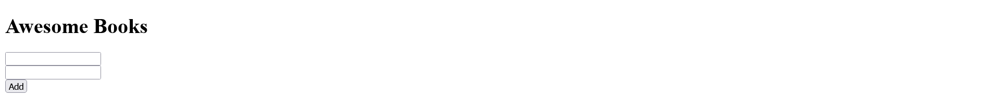

  <h1 align="center">Awesome Books</h1>

### Built with

- HTML
- JavaScript(ES6)
- Bootstrap 5
- Browser local storage

## Setup and run the app

- run `git clone https://github.com/muhenge/Awesomebooks.git` in your terminal
- cd into the folder
- open index.html with live server
## Live demo

[Live preview](https://awesomebook.netlify.app/)

### Author

👤 **Ngenzi Herve**

- Website: [Visit](https://ngenziherve.me)
- Github: [@muhenge](https://github.com/muhenge)
- LinkedIn: [Visit](https://www.linkedin.com/in/mugunga-herve-a62a0ab9/)

👤 **Maximiliano**

- Github: [@webdevmaxi](https://github.com/webdevmaxi)
- LinkedIn: [Visit](https://www.linkedin.com/in/mistermaxis/)

## 🤝 Contributing

Contributions, issues and feature requests are welcome!

Feel free to check the [issues page](https://github.com/muhenge/Awesomebooks/issues).

## Show your support

Give a ⭐️ if you like this project!

## Acknowledgments

- Microverse